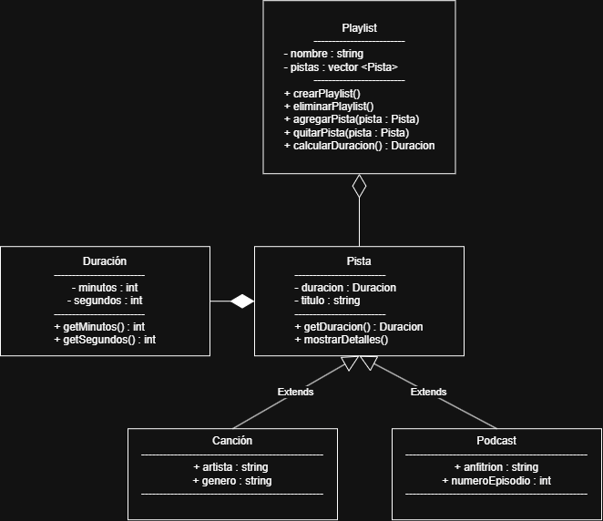

# Práctica 1: Playlist de música

Programación Orientada a Objetos · Ingeniería Mecatrónica · Tercer semestre

Llena cada espacio conforme avances en las fases de [PRACTICA.md](PRACTICA.md).

## Fase 1. Entender el problema

**1.1 El problema con mis propias palabras**

Diseñar una aplicacion para reproducir canciones y podcasts, con la posibilidad de crear playlists y poder editar estas.

**1.2 Sustantivos (posibles clases) y verbos (posibles métodos)**

Sustantivos: Canción, Podcast, Playlist, Pista, Duración

Verbos: Agregar Canción, Eliminar Canción, Agregar Podcast, Eliminar Podcast
        Crear Playlist, eliminar playlist, Agregar a playlist, Quitar de playlist, Forkear Playlist,

**1.3 Relaciones** (completa con "es un", "tiene un" o "usa un")

*   Una canción es una pista.
*   Un podcast es una pista.
*   Una pista tiene una duración.
*   Una playlist tiene una canción.

## Fase 2. Diseñar la solución

**2.1 Diagrama de clases**

**2.2 Justificación de cada relación**

| Relación | Tipo | ¿Por qué? |
| --- | --- | --- |
| Playlist - Pista | Agregación  | Pista puede existir sin que exista una playlist |
| Pista - Cancion  | Extensión   | Canción hereda la clase pista |
| Pista - Podcast  | Extensión   | Podcast hereda la clase pista |
| Pista - Duracion | Composición | Duración no puede existir sin la clase pista |

## Fase 3. Implementar

**3.1 Bitácora de dudas**

| # | Duda | Cómo la resolví | Fuente |
| --- | --- | --- | --- |
| 1 | ¿Cómo formatear los minutos y segundos para que siempre muestre dos dígitos en los segundos (ej. 3:05)? | Utilicé #include <iomanip> y manipuladores como std::setfill('0') y std::setw(2) en la función de impresión. | Documentación de C++ / repositorio de la práctica. |
| 2 | Error de compilación undefined reference al intentar compilar las clases por separado. | Incluí todos los archivos de implementación .cpp necesarios en el comando del compilador g++ (src/*.cpp). | Diagnóstico de errores de GCC/MinGW. |
| 3 | ¿Por qué la clase Playlist no destruye (delete) los punteros de canciones y podcasts en su estructura? | Se identificó que la relación es de agregación. Las pistas existen de forma independiente fuera de la playlist y no deben destruirse al destruir la playlist. | Conceptos de Programación Orientada a Objetos (POO) / Material del curso. |

**3.2 Experimentos guiados**

Experimento 1, orden de construcción y destrucción: Al instanciar un objeto derivado (Cancion o Podcast), se ejecuta primero el constructor de la clase base (Pista) y luego el de la derivada. Al destruirse, el orden se invierte: primero el destructor de la derivada y luego el de la base.

Experimento 2, ¿quién es dueño de quién?: La biblioteca principal (o la función main) es dueña de la vida de los objetos Cancion y Podcast. La Playlist solo guarda referencias (punteros) a ellos mediante agregación.

Experimento 3, un objeto en dos playlists: Sí es posible, ya que ambas playlists almacenan el puntero que apunta a la misma dirección de memoria del objeto en el heap/stack sin duplicar el objeto ni causar conflictos de propiedad.

## Fase 4. Probar y mejorar

**4.1 Tabla de pruebas**

| # | Caso | Resultado esperado | Resultado obtenido | ¿Pasa? |
| --- | --- | --- | --- | --- |
| 1 | Duración normal `Duracion(3, 45)` | 3:45 | 3:45 | Sí |
| 2 | Segundos mayores a 59 `Duracion(0, 75)` | 1:15 | 1:15 | Sí |
| 3 | Valores negativos `Duracion(-2, 10)` | 0:00 | 0:00 | Sí |
| 4 | Título vacío | "Sin título" | "Sin título" | Sí |
| 5 | Playlist vacía | 0:00 y 0 pistas | 0:00 y 0 pistas | Sí |
| 6 | Canción duplicada | Se permite la inserción repetida e incrementa la cantidad de pistas | Se agrega correctamente n veces | Chi |
| 7 | Total con 2 canciones y 1 podcast | Suma correcta en m:ss | Suma calculada correctamente | Smn |

**4.2 Bitácora de mejoras**

| # | Falla o mejora detectada | Qué cambié | Por qué |
| --- | --- | --- | --- |
| 1 | Errores de sincronización con la consola al mezclar std::cin >> y std::getline. | Agregué la función limpiarBuffer() con std::cin.ignore(...). | Evita que el salto de línea pendiente sea leído erróneamente por el siguiente getline. |
| 2 | Modelado de agregación repetida de pistas.| Se removió la validación de duplicados en agregarPista. | Una lista de reproducción real permite repetir la misma canción o podcast múltiples veces en el orden deseado.|
| 3 | Alineación con UML y Object Slicing. | Se cambió el almacenamiento a objetos por valor (std::vector<Pista>). | Cumple con la firma del diagrama UML original, demostrando deliberadamente el concepto de Object Slicing en C++. |

Retos opcionales que intenté: Hacer la tarea sin una cerveza, Falle.

## Fase 5. Publicar en GitHub

**5.1 Enlace a mi fork**

https://github.com/TacocraftG/Playlist_de_Musica.git

## Cierre y reflexión

**6.1 ¿Qué aprendiste en esta práctica?**

Aunque no del todo claro, aprendi a hacer slicing

**6.2 ¿Qué cambiarías de tu proceso la próxima vez?**

Rodearme de personas que sepan sobre POO, quiero decir, preguntarle más al profesor.